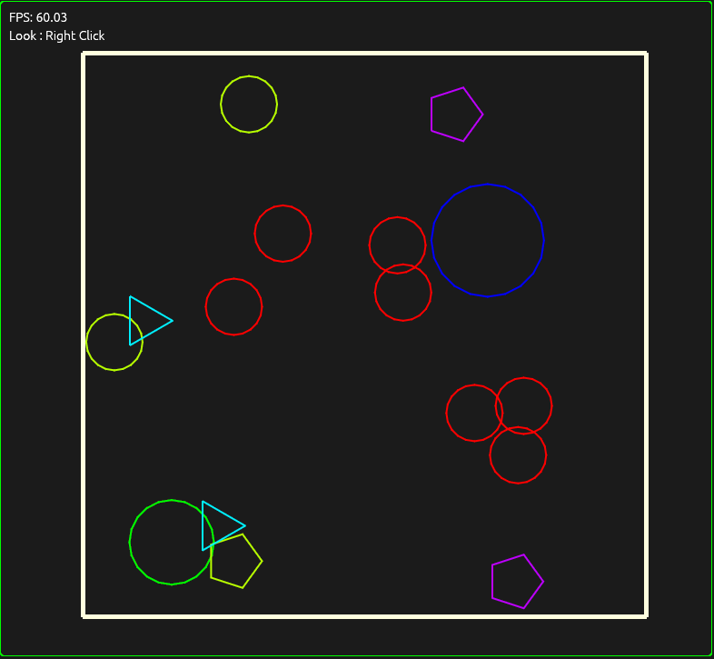
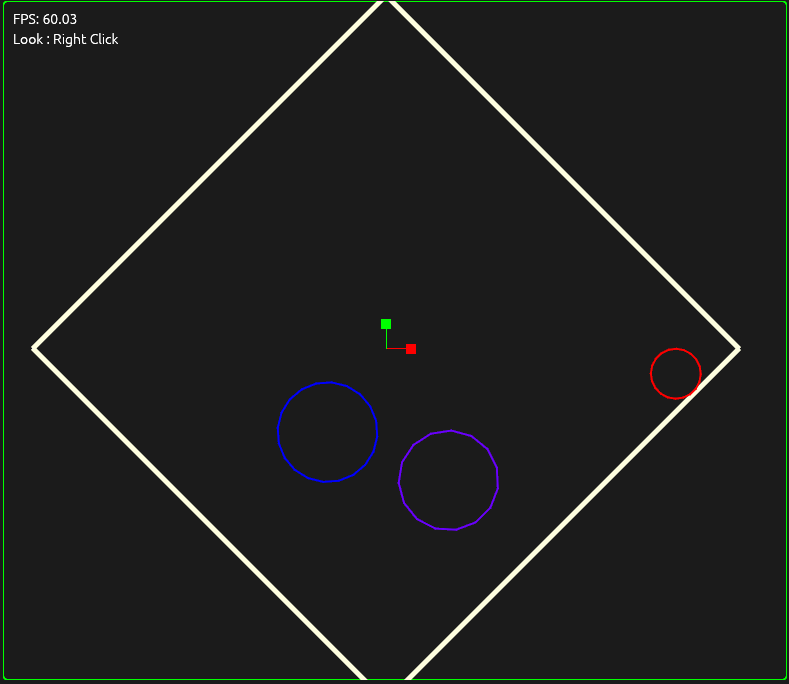
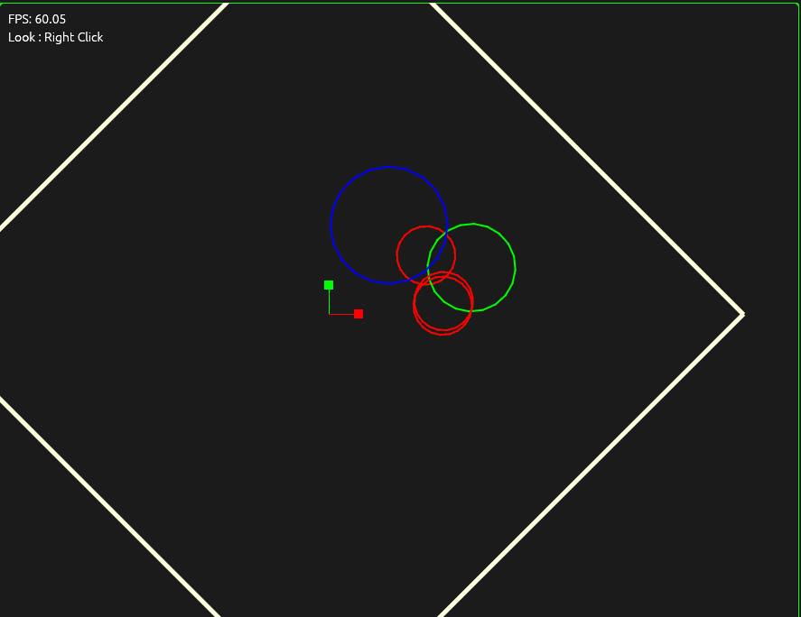
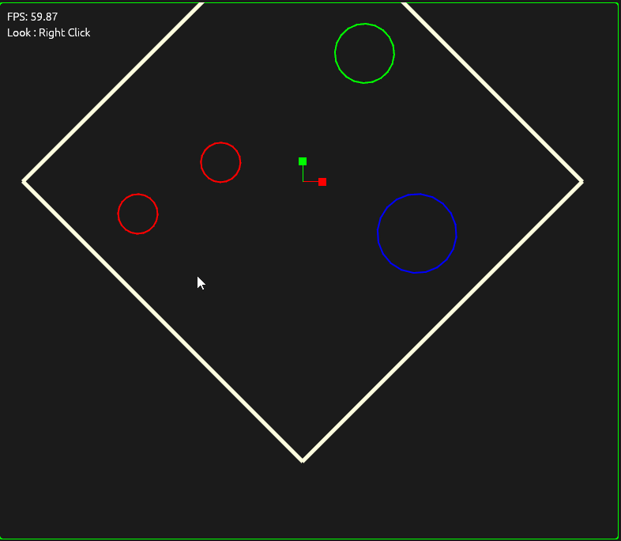

# Mumper - 2D Engine

Mumper is a 2D Engine written in Rust using egui 

## Features

-World Positions in meter 
-Polygon Drawing 

## Main Goals

-2D Coordinate / Camera system 
-Learn 2D Physics from scratch 

## Progress

 
 
 
 
 
 
