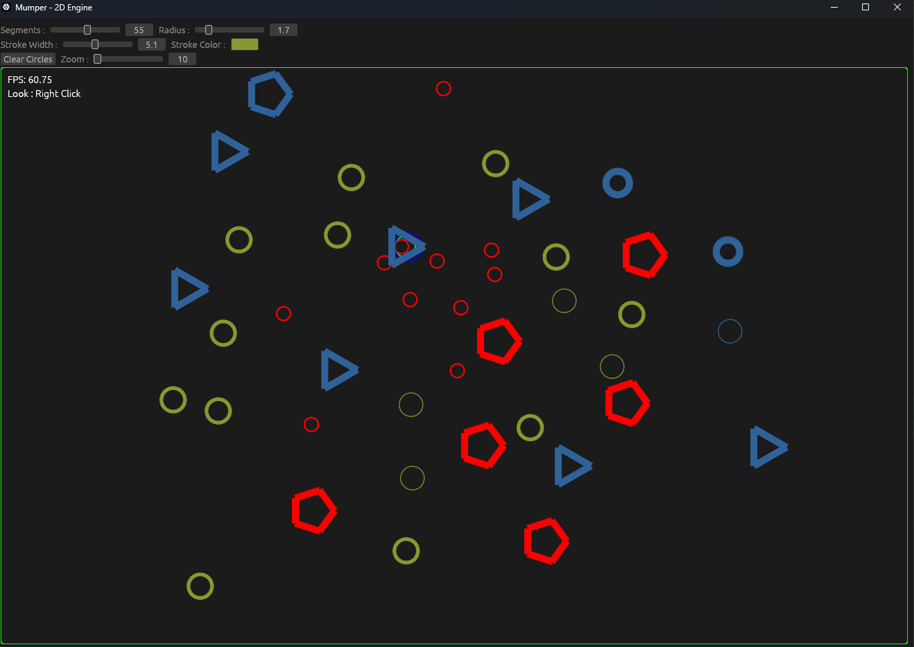
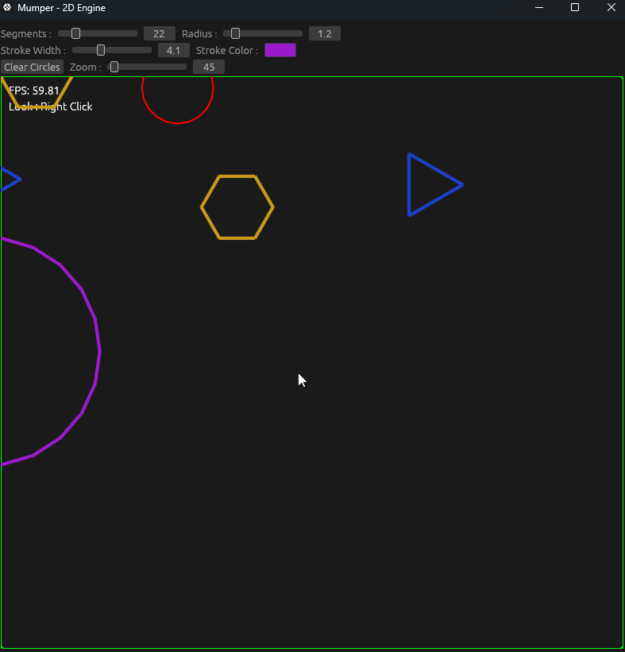
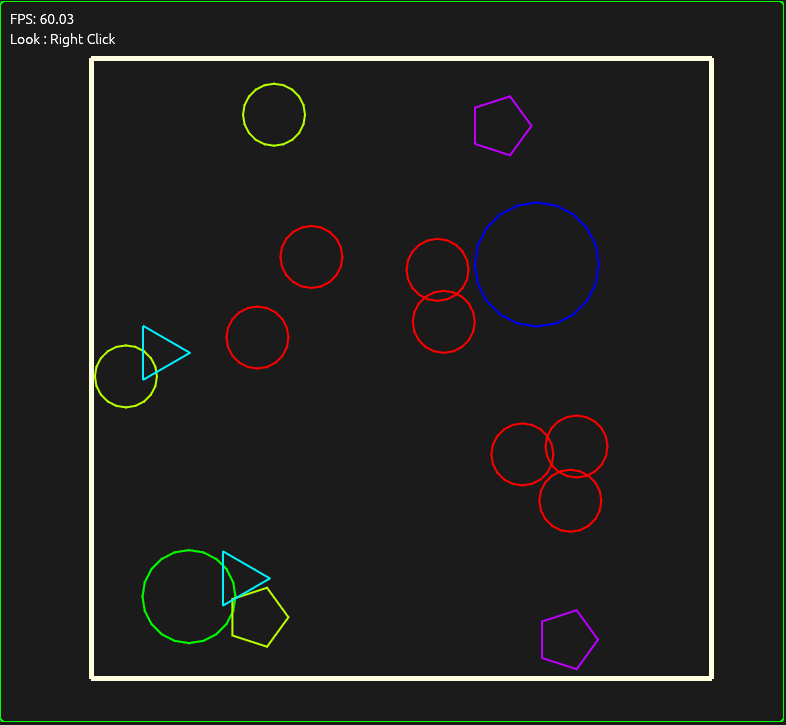
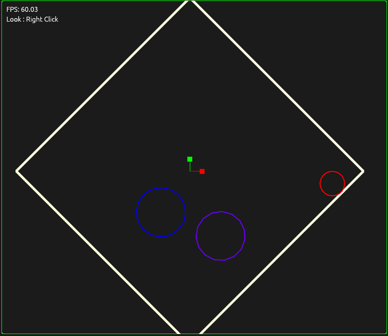
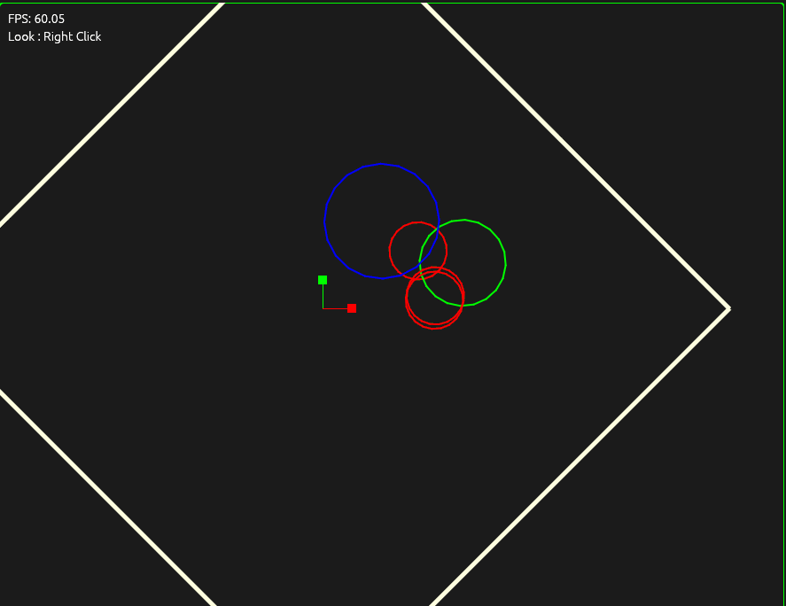
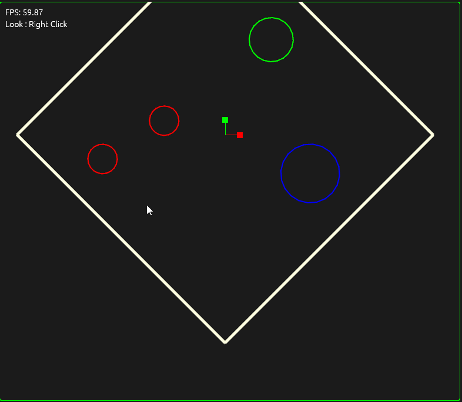
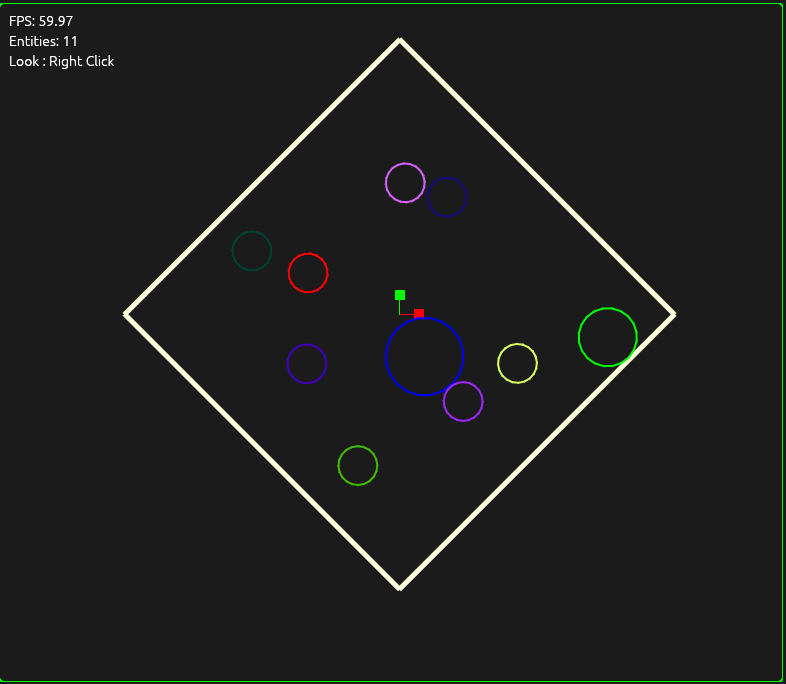

# Mumper - 2D Engine

Mumper is a 2D Library Engine written in Rust 
Checkout the [demo app](https://barbasoyun.github.io/Mumper-2D-Engine/) implementing the Engine 

## Features

-Demo version = Polygon Drawing 

-egui for rendering 
-World Positions in meter 
-Render 2D Shape using Vertices 
-2D Physics Engine 
-ECS with 5 Components : Renderer, Transform, RadiusCollider, SegmentsCollider, Rigidbody 

## Main Goals

-Make a 2D Coordinate / Camera system 
-Learn 2D Physics from scratch 
-Remake a better ECS 
-Have a simple 2D Engine ready for any sort of tests 

## Progress

 
 
 
 
 
 
 
